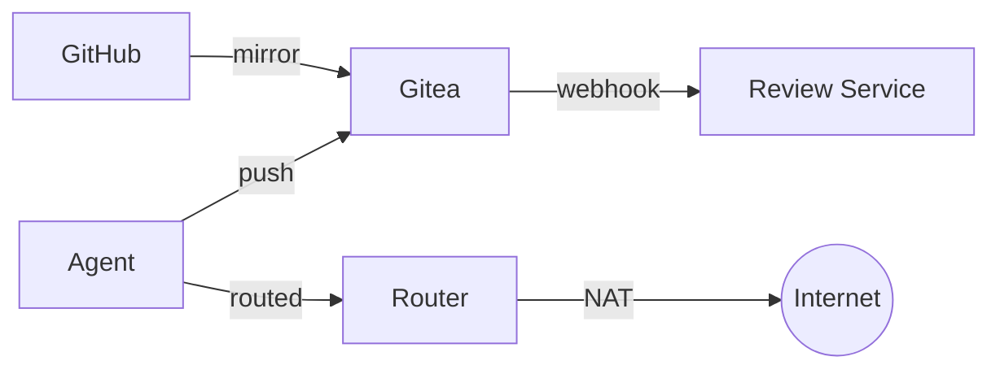
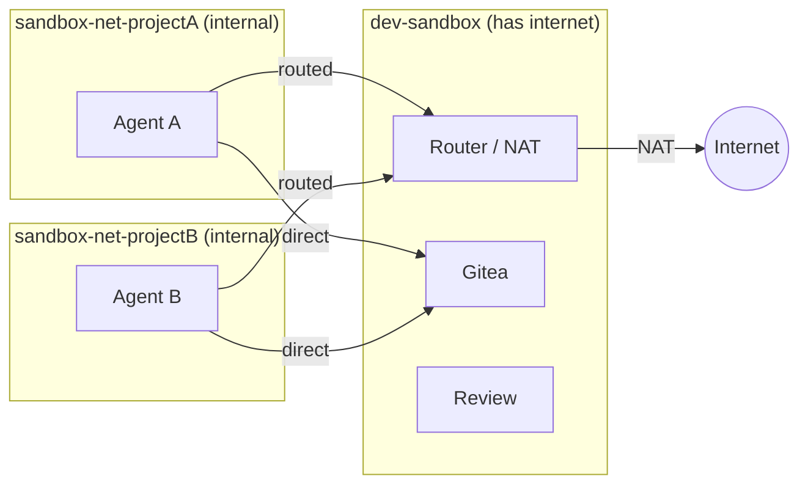

# Agentic Dev Sandbox

A straightforward, but opinionated, sandboxed development environment for agentic LLMs. The agent gets full autonomy
inside of a container, but is isolated from any user data, credential or private network outside of what it is explicitly given. 

*As it should be.*

## How it works



- **Gitea** mirrors your GitHub repos. The agent pushes to Gitea, never to GitHub.
- **Agent containers** are per-project, disposable, and hardened. They sit on internal
  Docker networks with no gateway — all external traffic is routed through a NAT router
  container that blocks LAN access and restricts egress ports by default.
- [Optional] **Review service** receives webhooks on agent pushes and posts automated security
  reviews (backdoors, exfiltration, dependency manipulation) as Gitea commit comments. 
- You review diffs in the Gitea webui or your IDE using `git fetch` from Gitea
- You merge what you want back to Github (human-in-the-loop)

## Prerequisites

- Docker with Compose v2 (`docker compose`)
- Python 3.10+, `git`

Optional:
- `GITHUB_PAT`: A read-only GitHub Personal Access Token (PAT), **only if mirroring private repos**. The agent has no access to it — only Gitea uses it.
- `REVIEWER_API_KEY` — needed if the automated security reviewer is enabled (supports Anthropic, OpenAI,
  OpenRouter, or local).

To generate the Github PAT (only needed for private repos):
  1. Go to https://github.com/settings/personal-access-tokens/new
  2. In Repository access, select the target repos (or all).
  3. In Permissions, click on Add Permissions and add **Contents**. Ensure it has **Access: Read-only**.

## Quick Start

```bash
# 1. Clone and configure
git clone https://github.com/joaopn/agentic-dev-sandbox.git
cd agentic-dev-sandbox

cp .env.example .env
# Edit .env: set GITHUB_PAT for private repos (optional for public), reviewer settings, etc.

# 2. One-time setup (starts Gitea, review service, router)
python sandbox.py setup

# 3. Create a sandboxed project with python and Claude Code
python sandbox.py create https://github.com/you/myproject --profile python --claude-yolo

# 4. Interact with the agent
python sandbox.py attach myproject
## You're in a byobu terminal session inside the agent container.
## F6 to detach — the agent keeps working. F2 for another terminal, F3/F4 to switch.
## If --claude-yolo, `claude` will prompt authentication

# 5. Review the agent's work 
## From the Gitea GUI: http://localhost:3000 (default port)
## From your real repo
cd ~/repos/myproject
git remote add staging http://localhost:3000/agent-myproject/myproject.git
python /path/to/sandbox.py review myproject feature-branch
## Shows: security review, symlink check, auto-execute file check, diffstat

# 6. Merge what you want
git diff main...staging/agent/feature-branch
git merge --squash staging/agent/feature-branch
git commit
git push origin main
```

After a reboot or `docker compose down`, bring infrastructure back with:

```bash
docker compose up -d           # Gitea, router, review service
python sandbox.py start --all  # Agent containers
```

To fully tear down everything (all agent containers, volumes, networks, and infrastructure):

```bash
python sandbox.py unsetup
```

This removes all agent containers and their workspace volumes, stops and removes Gitea/router/review
containers and their Docker volumes, cleans up per-project networks, and removes the generated
`GITEA_ADMIN_TOKEN` from `.env`. Your other `.env` settings are preserved — run `sandbox setup` to
start fresh.

## CLI Reference

```
sandbox <command> [options]

Commands:
  setup                          One-time infrastructure setup
  unsetup                        Tear down everything (containers, volumes, networks, Gitea data)
  create <github-url> [opts]     Mirror repo, spin up agent container
  attach <project>               Attach to agent's byobu session
  ssh                            Show SSH connection info (ports + passwords)
  stop <project|--all>           Stop agent container(s)
  start <project|--all>          Start stopped container(s)
  pause <project|--all>          Freeze container(s) in place (cgroup)
  unpause <project|--all>        Resume frozen container(s)
  sync <project>                 Trigger Gitea mirror sync from GitHub
  review <project> <branch>      Fetch, security review, safety checks, diffstat
  recreate <project> [opts]      New container + fresh token, keeps volume
  status                         List all projects, containers, ports
  destroy <project>              Remove container, volume, Gitea user + fork
  logs <project>                 Tail container logs

Create/recreate options:
  --profile <name>               Agent image profile (required)
  --branch <name>                Branch to check out
  --open-egress                  Allow all outbound ports (default: 80/443/DNS)
  --memory <limit>               Container memory limit (default: unlimited)
  --cpus <limit>                 Container CPU limit
  --gpus <device>                GPU passthrough (e.g., "all"); requires NVIDIA Container Toolkit
  --ssh-port <port>              Host port for SSH (default: auto-assigned)
  --claude-yolo                  Install Claude Code, auto-configure bypass permissions
```

## File Structure

```
agentic-dev-sandbox/
├── sandbox.py                    Main CLI (Python 3, stdlib only)
├── docker-compose.yml            Gitea + review service + router
├── .env                          Config + secrets (gitignored)
├── .env.example                  Template
├── container/                    Files copied into each agent workspace
│   └── CLAUDE.md                 Default agent instructions
├── agent/
│   ├── Dockerfile.python         Agent image: conda, git, byobu, sshd
│   └── entrypoint.sh            Clone, configure git, start sshd + byobu (shared)
├── review/
│   ├── Dockerfile                Review service image
│   ├── review-server.py          Webhook listener: diff → LLM review → comment
│   └── review-config.yaml        Prompt, provider endpoints, tunables
└── router/
    ├── Dockerfile                NAT router image (Alpine + iptables)
    └── scripts/
        ├── entrypoint.sh         NAT, firewall setup
        ├── apply-rules.sh        Per-network iptables rules (idempotent)
        └── remove-rules.sh       Cleanup rules for a subnet
```

### `container/` directory

Any files placed in `container/` are copied into each agent's home directory volume at `/home/agent/`.
Use this to provide config files or custom instructions to every agent. For key-based SSH access,
place your public key at `container/.ssh/authorized_keys`.
By default it ships with a `CLAUDE.md` containing baseline agent instructions.

### Git remotes inside the container

Each agent container has two git remotes:
- **`origin`** — the agent's fork on Gitea (read-write)
- **`upstream`** — the mirror of the GitHub repo (read-only)

After you merge the agent's work on GitHub and the mirror syncs, the agent must
`git fetch upstream && git merge upstream/main` before starting new work. This is
**not done automatically** — it is up to the agent (or the user) to sync. The default
`CLAUDE.md` instructs Claude Code to do this before each task.


## VS Code Remote-SSH

Connect to agent containers via VS Code Remote-SSH for full IDE access:

```bash
sandbox ssh   # shows port + password for all containers
ssh agent@localhost -p <ssh-port>
```

Once connected, run `byobu attach` in the VS Code terminal to connect to the
agent session. Displaying the password is not a security issue, as anyone with docker permissions
can already connect directly to the agent container.

**Important**: Verify these VS Code settings are disabled before connecting:
- `remote.SSH.enableAgentForwarding` — must be off (forwards host SSH keys)
- Git credential forwarding — must not be configured

## Image Profiles

Profiles let you pick different base environments for agent containers. Each profile is a
Dockerfile in `agent/` named `Dockerfile.<profile>`. 

| Profile | Base image | Includes |
|---|---|---|
| `python` | `continuumio/miniconda3` | Conda, git, byobu, sshd |

```bash
python sandbox.py create https://github.com/you/myproject --profile python
```

To add a custom profile, create `agent/Dockerfile.myprofile`. It must set up a non-root
`agent` user (UID 1000) with passwordless sudo, an SSH server, and `/home/agent` as the
working directory. Copy an existing Dockerfile as a starting point. The entrypoint is always
`agent/entrypoint.sh`.


## Reviewer Configuration

The review service posts automated security reviews as Gitea commit comments. It
supports multiple LLM providers and can be disabled entirely.

Runtime settings go in `.env`, while the review prompt and default provider
endpoints live in `review/review-config.yaml`.

**Env vars** (`.env`):

| Variable | Description | Default |
|---|---|---|
| `REVIEWER_ENABLED` | Enable automated reviews (`true`/`false`) | `false` |
| `REVIEWER_PROVIDER` | LLM provider: `anthropic`, `openai`, `openrouter`, `local` | `anthropic` |
| `REVIEWER_API_KEY` | API key for the provider | (required unless local) |
| `REVIEWER_MODEL` | Model name | (required) |
| `REVIEWER_ENDPOINT` | Custom API endpoint (overrides config yaml) | from config yaml |

Default endpoints per provider are in `review/review-config.yaml`. The `local`
provider has no default — `REVIEWER_ENDPOINT` is required.

**Examples:**

```bash
# Disable reviews entirely
REVIEWER_ENABLED=false

# Use OpenAI
REVIEWER_PROVIDER=openai
REVIEWER_API_KEY=sk-xxxx
REVIEWER_MODEL=gpt-4o

# Use a local vLLM instance
REVIEWER_PROVIDER=local
REVIEWER_MODEL=meta-llama/Llama-3.1-70B-Instruct
REVIEWER_ENDPOINT=http://192.168.1.50:8000
```

When `REVIEWER_ENABLED=false`, the review service container is not started
and no webhooks are created on agent repos.

**Customizing the review prompt:** Edit `review/review-config.yaml`. The prompt
must contain a `{diff}` placeholder. Rebuild the review container after changes:
`docker compose build review && docker compose up -d review`.

## Network Isolation

Each agent gets its own **internal Docker network** (`sandbox-net-{project}`) with
no gateway — it cannot reach the internet or your LAN directly. A NAT router container
bridges the agent's internal network and the external network, providing native
DNS, ICMP, and all-protocol support without any proxy configuration.



This means:
- **Agents are isolated from each other** — each project gets its own internal
  network. Agent A cannot reach Agent B, even if both are running simultaneously.
- **All internet traffic is routed through the router** — the agent's default route
  points to the router container. If the router is down, the agent has no external
  connectivity (fail-closed).
- **LAN is unreachable** — the router's iptables FORWARD chain drops all traffic
  to RFC1918 destinations (10.0.0.0/8, 172.16.0.0/12, 192.168.0.0/16, link-local).
- **Egress port filtering** (default): Only HTTP (80), HTTPS (443), DNS (53), and
  ICMP are allowed. Use `--open-egress` to allow all destination ports.
- **Native networking** — `ping`, `apt`, `pip`, `curl`, and any tool that expects
  normal internet access work out of the box. No proxy configuration needed.
- **Infrastructure access** — Gitea, router, and review service are connected to
  each agent's network on demand, so the agent can reach them directly.
- **Route injection** — the agent's default route is set via a throwaway privileged
  container (`docker run --rm --privileged --network container:<agent> alpine ip route ...`).
  The agent never receives NET_ADMIN and cannot modify its own routing.

## Security Model

| Threat | Defense |
|---|---|
| Agent pushes to real GitHub | No GitHub credentials in container |
| Agent reads host filesystem | Docker volume, no bind mount |
| Agent reaches LAN/host | Internal Docker network (no gateway) + router iptables drops RFC1918 |
| Agent exfiltrates via non-standard ports | Router FORWARD chain allows only 80/443/DNS/ICMP (default) |
| Agent modifies its own routing | No NET_ADMIN capability; route injected from a separate throwaway container |
| Router goes down | Fail-closed: internal network has no gateway, agent loses all external connectivity |
| Poisoned code enters real repo | Gitea air gap + LLM security review + human review |
| Symlinks/dotfiles auto-execute | Pre-merge safety checks flag them |
| Agent modifies its own review | Separate API key, separate container |
| Agent accesses other projects | Per-project Gitea user + per-project network isolation |
| Compromised agent attacks others | Per-project networks prevent inter-agent communication |

### Not prevented

- Agent reading all code in its project (necessary for it to work)
- HTTPS exfiltration to public endpoints (inherent to internet access)
- LLM review missing a subtle backdoor (it's a filter, not a guarantee)
- Container escape via unpatched kernel/runc CVE (same risk as any container)

## FAQ

### Why not use dev containers?

Dev containers were designed to give you a reproducible dev environment, not to isolate an untrusted agent. 
By default they bind-mount your project directory (read-write), share the host network, and have no egress filtering. 
The agent can read your `.git/config`, reach `localhost` services, and access anything in the mounted tree.

### Can't I just harden the dev container?

The IDE works against you. 
VS Code (for instance) automatically forwards your SSH agent, git credentials, and GPG keys into the container. 
Extensions run with full container permissions. 
An update can re-enable unhardened defaults.


### GPU / CUDA support?

Install the [NVIDIA Container Toolkit](https://docs.nvidia.com/datacenter/cloud-native/container-toolkit/latest/install-guide.html) on the host and pass `--gpus all` when creating the project. Create a custom profile with a CUDA base image if your workload needs one — the toolkit mounts the host driver automatically.

### Rootless Docker support?

If you already run [rootless Docker](https://docs.docker.com/engine/security/rootless/), the sandbox works as-is with no changes. 
The added benefit is that a container escape lands as your unprivileged user rather than root, and granted capabilities (CHOWN,SETUID, etc.) are scoped to a user namespace that can't affect the real host. 
This doesn't prevent the escape itself, but limits the blast radius. 
Not required — regular Docker with the network isolation above is the intended baseline.