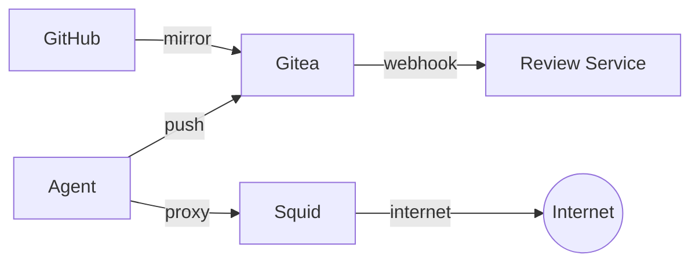
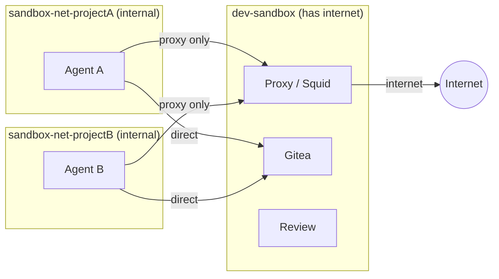

# Agentic Dev Sandbox

A straightforward, but opinionated, sandboxed development environment for agentic LLMs. The agent gets full autonomy
inside of a container, but is isolated from any user data, credential or private network outside of what it is explicitly given. 

*As it should be.*

## How it works



- **Gitea** mirrors your GitHub repos. The agent pushes to Gitea, never to GitHub.
- **Agent containers** are per-project, disposable, and hardened. They connect through
  a Squid proxy that blocks LAN access and restricts egress to HTTP/HTTPS/DNS by default.
- [Optional] **Review service** receives webhooks on agent pushes and posts automated security
  reviews (backdoors, exfiltration, dependency manipulation) as Gitea commit comments. 
- You review diffs in the Gitea webui or your IDE using `git fetch` from Gitea and merge what you want.

## Prerequisites

- Docker with Compose v2 (`docker compose`)
- Python 3.10+, `git`
- A read-only GitHub Personal Access Token (PAT). **The agent has no access to it, only Gitea**.

Optional:
- `SANDBOX_CLAUDE_KEY` — only needed with `--claude` flag (pre-installs and auto-starts Claude Code CLI
  with the key baked in). Not needed if you use an IDE extension (e.g. Claude Code for VS Code via
  Remote-SSH) or install the CLI manually inside the container. Named distinctly to avoid picking up
  `ANTHROPIC_API_KEY` from the shell environment.
- `REVIEWER_API_KEY` — needed if the automated security reviewer is enabled (supports Anthropic, OpenAI,
  OpenRouter, or local).

To generate the Github PAT:
  1. Go to https://github.com/settings/personal-access-tokens/new
  2. In Repository access, select the target repos (or all). 
  3. In Permissions, click on Add Permissions and add **Contents**. Ensure it has **Access: Read-only**.

## Quick Start

```bash
# 1. Clone and configure
git clone https://github.com/joaopn/agentic-dev-sandbox.git
cd agentic-dev-sandbox

cp .env.example .env
# Edit .env: set GITHUB_PAT (and optionally reviewer settings, SANDBOX_CLAUDE_KEY if you want pre-configured Claude Code)

# 2. One-time setup (starts Gitea, review service, proxy)
python sandbox.py setup

# 3. Create a sandboxed project
python sandbox.py create https://github.com/you/myproject --claude

# 4. Interact with the agent
python sandbox.py attach myproject
# You're in a byobu terminal session with Claude Code running
# Give it a task, then F6 to detach — the agent keeps working. F2 for another terminal, F3/F4 to switch.

# 5. Review the agent's work (from your real repo)
cd ~/repos/myproject
git remote add staging http://localhost:3000/agent-myproject/myproject.git
python /path/to/sandbox.py review myproject feature-branch
# Shows: security review, symlink check, auto-execute file check, diffstat

# 6. Merge what you want
git diff main...staging/agent/feature-branch
git merge --squash staging/agent/feature-branch
git commit
git push origin main
```

After a reboot or `docker compose down`, bring infrastructure back with:

```bash
docker compose up -d           # Gitea, proxy, review service
python sandbox.py start --all  # Agent containers
```

## CLI Reference

```
sandbox <command> [options]

Commands:
  setup                          One-time infrastructure setup
  create <github-url> [opts]     Mirror repo, spin up agent container
  attach <project>               Attach to agent's byobu session
  stop <project|--all>           Stop agent container(s)
  start <project|--all>          Start stopped container(s)
  pause <project|--all>          Freeze container(s) in place (cgroup)
  unpause <project|--all>        Resume frozen container(s)
  sync <project>                 Trigger Gitea mirror sync from GitHub
  review <project> <branch>      Fetch, security review, safety checks, diffstat
  recreate <project> [opts]      New container + fresh token, keeps volume
  status                         List all projects, containers, ports
  destroy <project>              Remove container, volume, Gitea user
  logs <project>                 Tail container logs

Create/recreate options:
  --branch <name>                Branch to check out
  --claude                       Install Claude Code CLI, auto-start in byobu
  --open-egress                  Allow all outbound ports (default: 80/443/DNS)
  --memory <limit>               Container memory limit (default: unlimited)
  --cpus <limit>                 Container CPU limit
  --gpus <device>                GPU passthrough (e.g., "all"); requires NVIDIA Container Toolkit
  --image <name>                 Custom agent Docker image
  --ssh-port <port>              Host port for SSH (default: auto-assigned)
```

## Network Isolation

Each agent gets its own **internal Docker network** (`sandbox-net-{project}`) with
no gateway — it cannot reach the internet or your LAN directly. The only path out
is through a Squid proxy that bridges the agent's network and the external network.



This means:
- **Agents are isolated from each other** — each project gets its own internal
  network. Agent A cannot reach Agent B, even if both are running simultaneously.
- **All internet traffic is forced through the proxy** — even raw TCP connections
  that ignore `HTTP_PROXY` simply fail (no route exists).
- **LAN is unreachable** — internal networks have no gateway to RFC1918 addresses.
  The proxy also blocks LAN destinations as defense-in-depth.
- **Egress port filtering** (default): The proxy allows only TCP 80/443.
  Use `--open-egress` to allow all destination ports through the proxy.
- **Infrastructure access** — Gitea, proxy, and review service are connected to
  each agent's network on demand, so the agent can reach them directly.

## Security Model

| Threat | Defense |
|---|---|
| Agent pushes to real GitHub | No GitHub credentials in container |
| Agent reads host filesystem | Docker volume, no bind mount |
| Agent reaches LAN/host | Internal Docker network (no gateway) + proxy LAN ACLs |
| Agent exfiltrates via non-HTTPS | Internal network forces all traffic through proxy |
| Poisoned code enters real repo | Gitea air gap + LLM security review + human review |
| Symlinks/dotfiles auto-execute | Pre-merge safety checks flag them |
| Agent modifies its own review | Separate API key, separate container |
| Agent accesses other projects | Per-project Gitea user + per-project network isolation |
| Compromised agent attacks others | Per-project networks prevent inter-agent communication |

### Not prevented

- Agent reading all code in its project (necessary for it to work)
- HTTPS exfiltration to public endpoints (inherent to internet access)
- LLM review missing a subtle backdoor (it's a filter, not a guarantee)
- Container escape via unpatched kernel/runc CVE (same risk as any container)


## VS Code Remote-SSH

Connect to agent containers via VS Code Remote-SSH for full IDE access:

```
ssh agent@localhost -p <ssh-port>
```

The SSH port is printed by `sandbox create`. Once connected, run `byobu attach`
in the VS Code terminal to connect to the agent session.

**Important**: Verify these VS Code settings are disabled before connecting:
- `remote.SSH.enableAgentForwarding` — must be off (forwards host SSH keys)
- Git credential forwarding — must not be configured

## Reviewer Configuration

The review service posts automated security reviews as Gitea commit comments. It
supports multiple LLM providers and can be disabled entirely.

Runtime settings go in `.env`, while the review prompt and default provider
endpoints live in `review/review-config.yaml`.

**Env vars** (`.env`):

| Variable | Description | Default |
|---|---|---|
| `REVIEWER_ENABLED` | Enable automated reviews (`true`/`false`) | `true` |
| `REVIEWER_PROVIDER` | LLM provider: `anthropic`, `openai`, `openrouter`, `local` | `anthropic` |
| `REVIEWER_API_KEY` | API key for the provider | (required unless local) |
| `REVIEWER_MODEL` | Model name | (required) |
| `REVIEWER_ENDPOINT` | Custom API endpoint (overrides config yaml) | from config yaml |

Default endpoints per provider are in `review/review-config.yaml`. The `local`
provider has no default — `REVIEWER_ENDPOINT` is required.

**Examples:**

```bash
# Disable reviews entirely
REVIEWER_ENABLED=false

# Use OpenAI
REVIEWER_PROVIDER=openai
REVIEWER_API_KEY=sk-xxxx
REVIEWER_MODEL=gpt-4o

# Use a local vLLM instance
REVIEWER_PROVIDER=local
REVIEWER_MODEL=meta-llama/Llama-3.1-70B-Instruct
REVIEWER_ENDPOINT=http://192.168.1.50:8000
```

When `REVIEWER_ENABLED=false`, the review service container is not started
and no webhooks are created on agent repos.

**Customizing the review prompt:** Edit `review/review-config.yaml`. The prompt
must contain a `{diff}` placeholder. Rebuild the review container after changes:
`docker compose build review && docker compose up -d review`.

## File Structure

```
agentic-dev-sandbox/
├── sandbox.py                    Main CLI (Python 3, stdlib only)
├── docker-compose.yml            Gitea + review service + proxy
├── .env                          Config + secrets (gitignored)
├── .env.example                  Template
├── container/
│   └── CLAUDE.md                 Agent instructions (copied into each workspace)
├── agent/
│   ├── Dockerfile                Agent image: python, node, git, byobu, sshd
│   └── entrypoint.sh            Clone, configure git, start sshd + byobu
├── review/
│   ├── Dockerfile                Review service image
│   ├── review-server.py          Webhook listener: diff → LLM review → comment
│   └── review-config.yaml        Prompt, provider endpoints, tunables
└── proxy/
    ├── Dockerfile                Squid proxy image
    └── squid.conf                ACLs: port filtering, LAN blocking (defense-in-depth)
```

## FAQ

### Why not use dev containers?

Dev containers were designed to give you a reproducible dev environment, not to isolate an untrusted agent. 
By default they bind-mount your project directory (read-write), share the host network, and have no egress filtering. 
The agent can read your `.git/config`, reach `localhost` services, and access anything in the mounted tree.

### Can't I just harden the dev container?

The IDE works against you. 
VS Code (for instance) automatically forwards your SSH agent, git credentials, and GPG keys into the container. 
Extensions run with full container permissions. 
An update can re-enable unhardened defaults.

### GPU / CUDA support?

Install the [NVIDIA Container Toolkit](https://docs.nvidia.com/datacenter/cloud-native/container-toolkit/latest/install-guide.html) on the host and pass `--gpus all` when creating the project. Use `--image` to provide a CUDA base image if your workload needs one — the toolkit mounts the host driver automatically.

### Rootless Docker support?

If you already run [rootless Docker](https://docs.docker.com/engine/security/rootless/), the sandbox works as-is with no changes. 
The added benefit is that a container escape lands as your unprivileged user rather than root, and granted capabilities (CHOWN,SETUID, etc.) are scoped to a user namespace that can't affect the real host. 
This doesn't prevent the escape itself, but limits the blast radius. 
Not required — regular Docker with the network isolation above is the intended baseline.