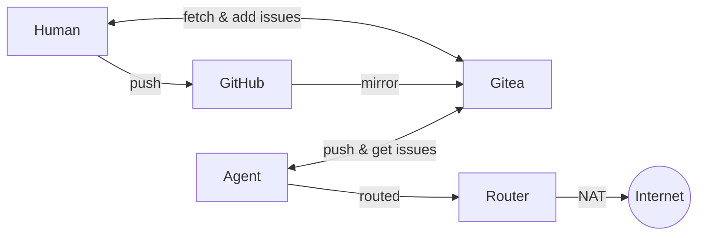
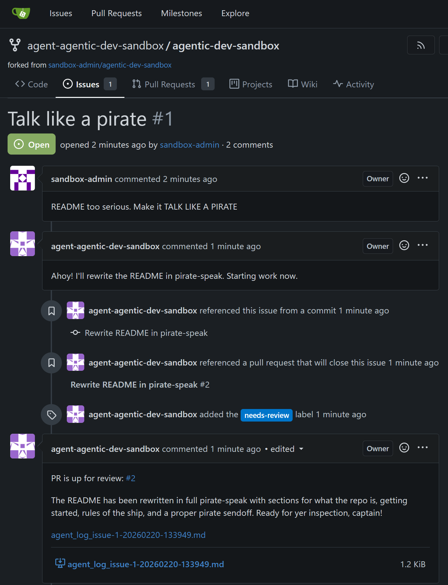
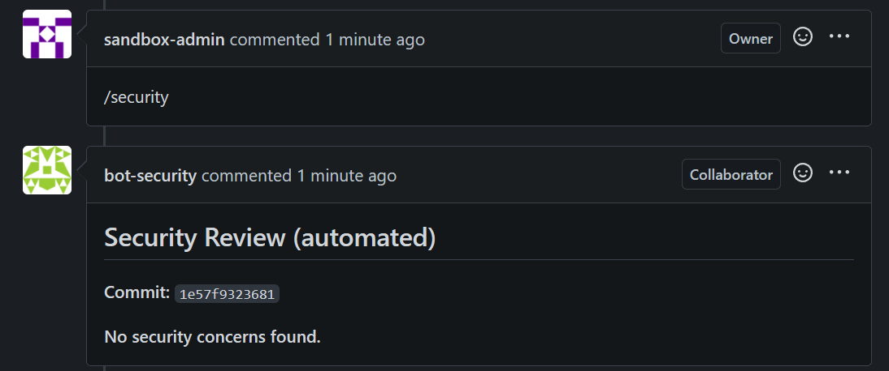

# Agentic Dev Sandbox

A simple, but opinionated, sandboxed development environment for agentic LLMs. The agent gets full autonomy inside of a container, but is isolated from any user data, credential or private network outside of what it is explicitly given.

*As it should be.*

## Very Quick Start
```bash
# 1. One-time setup (starts Gitea, router)
python sandbox.py setup

# 2. Creates a sandboxed project with python and pre-install Claude Code in YOLO mode
python sandbox.py create https://github.com/you/myproject --profile python --claude-yolo

# 3. Interacts with the agent 
## Use `claude` to authenticate Claude Code, F2/F3/F4 to manage windows
python sandbox.py attach myproject
```

## How it works



- **Local Gitea** mirrors your GitHub repos. The agent pushes to Gitea, never to GitHub
- **Agent containers** are per-project, disposable, and hardened. They can't access your LAN
  - [Optional] **Repo Watch** has the agent monitoring Gitea Issues and working on them automatically
  - [Optional] **Review service** posts automated security reviews (backdoors, exfiltration, dependency manipulation) on `/security` command
- You review code in the Gitea webui or your IDE using `git fetch` from Gitea
- You merge what you want back to GitHub (human-in-the-loop)

See [SECURITY.md](docs/SECURITY.md) for the full threat model and network isolation details.

## Repo Watch

The agent can monitor its Gitea repo (`http://localhost:3000`) for issues and PR activity. You open an issue, the agent picks it up, discusses via comments, writes code, opens PRs, and merges when you approve. You interact as a maintainer; the agent works as a junior dev.

<p align="center">
  
</p>


To use:
```bash
# Inside the agent container (after sandbox attach)
claude                # authenticate first
./repo-watch.sh       # starts monitoring — blocks terminal
# F2 for a new byobu window
```

See [Repo Watch](docs/GUIDE.md#repo-watch) in the guide for details.

## Reviewer

An isolated bot (`bot-security`) can review PRs for security issues on command. Comment `/security` on any PR in Gitea to trigger a review. The bot posts findings as a PR comment.

<p align="center">
  
</p>

To use:
```bash
python sandbox.py review setup   # configure provider, key, model (one-time)
python sandbox.py review on      # start after reboot
```

See [Reviewer](docs/GUIDE.md#reviewer) in the guide for provider options and customization.

## Prerequisites

- Docker with Compose v2 (`docker compose`)
- Python 3.10+

Optional:
- `GITHUB_PAT` — A read-only GitHub Personal Access Token (PAT), **only if mirroring private repos**. Only Gitea sees it.
- `REVIEWER_API_KEY` — an LLM API key needed if the optional `bot-security` is enabled (supports Anthropic, OpenAI, OpenRouter, or local). Only the reviewer service sees it.

To generate the GitHub PAT:
  1. Go to https://github.com/settings/personal-access-tokens/new
  2. In Repository access, select the target repos (or all).
  3. In Permissions, click on Add Permissions and add **Contents**. Ensure it has **Access: Read-only**.

## Quick Start

```bash
# 1. Clone and configure
git clone https://github.com/joaopn/agentic-dev-sandbox.git
cd agentic-dev-sandbox

cp .env.example .env
# Edit .env: set GITHUB_PAT for private repos

# 2. One-time setup (starts Gitea, router)
python sandbox.py setup

# Optional: configure and start the reviewer service
python sandbox.py review setup

# 3. Create a sandboxed project with python and Claude Code
python sandbox.py create https://github.com/you/myproject --profile python --claude-yolo

# 4. Interact with the agent
python sandbox.py attach myproject
## You're in a byobu terminal session inside the agent container. Code away.
## F6 to detach — the agent keeps working. F2 for another terminal, F3/F4 to switch.
## If --claude-yolo, `claude` will prompt authentication

# 5. Review the agent's work
## From the Gitea GUI: http://localhost:3000 (default port)
## From your real repo
cd ~/repos/myproject
git remote add staging http://localhost:3000/agent-myproject/myproject.git
python /path/to/sandbox.py review myproject feature-branch
## Shows: security review, symlink check, auto-execute file check, diffstat

# 6. Merge what you want
git diff main...staging/agent/feature-branch
git merge --squash staging/agent/feature-branch
git commit
git push origin main
```

## CLI Reference

```
sandbox <command> [options]

Commands:
  setup                          One-time infrastructure setup
  unsetup                        Tear down everything (containers, volumes, networks, Gitea data)
  create <github-url> [opts]     Mirror repo, spin up agent container
  attach <project>               Attach to agent's byobu session
  ssh                            Show SSH connection info (ports + passwords)
  stop <project|--all>           Stop agent container(s)
  start <project|--all>          Start stopped container(s)
  pause <project|--all>          Freeze container(s) in place (cgroup)
  unpause <project|--all>        Resume frozen container(s)
  sync <project>                 Trigger Gitea mirror sync from GitHub
  review show <project> <branch>  Fetch, security review, safety checks, diffstat
  review setup                   Configure and start the review service
  review on / off                Toggle reviewer without re-prompting
  recreate <project> [opts]      New container + fresh token, keeps volume
  status                         List all projects, containers, ports
  destroy <project>              Remove container, volume, Gitea user + fork
  logs <project>                 Tail container logs

Create/recreate options:
  --profile <name>               Agent image profile (required)
  --branch <name>                Branch to check out
  --open-egress                  Allow all outbound ports (default: 80/443/DNS)
  --memory <limit>               Container memory limit (default: unlimited)
  --cpus <limit>                 Container CPU limit
  --gpus <device>                GPU passthrough (e.g., "all"); requires NVIDIA Container Toolkit
  --ssh-port <port>              Host port for SSH (default: auto-assigned)
  --claude-yolo                  Install Claude Code, auto-configure bypass permissions
```

## File Structure

```
agentic-dev-sandbox/
├── sandbox.py                    Main CLI (Python 3, stdlib only)
├── docker-compose.yml            Gitea + review service + router
├── .env                          Config + secrets (gitignored)
├── .env.example                  Template
├── container/                    Files copied into each agent workspace
│   ├── CLAUDE.md                 Default agent instructions
│   ├── repo-watch.sh             Agentic loop: polls issues, invokes Claude Code
│   └── repo-watch-prompt.md      Prompt template for repo-watch
├── agent/
│   ├── Dockerfile.python         Agent image: conda, git, byobu, sshd
│   └── entrypoint.sh            Clone, configure git, start sshd + byobu (shared)
├── review/
│   ├── Dockerfile                Review service image
│   ├── review-server.py          Webhook listener: diff → LLM review → comment
│   └── review-config.yaml        Prompt, provider endpoints, tunables
├── router/
│   ├── Dockerfile                NAT router image (Alpine + iptables)
│   └── scripts/
│       ├── entrypoint.sh         NAT, firewall setup
│       ├── apply-rules.sh        Per-network iptables rules (idempotent)
│       └── remove-rules.sh       Cleanup rules for a subnet
└── docs/
    ├── GUIDE.md                  Profiles, reviewer, VS Code, FAQ, repo-watch details
    └── SECURITY.md               Security model, network isolation, threat table
```

## Further Reading

- **[docs/GUIDE.md](docs/GUIDE.md)** — Image profiles, reviewer configuration, VS Code Remote-SSH, networking details, `container/` directory, git remotes, repo-watch internals, FAQ.
- **[docs/SECURITY.md](docs/SECURITY.md)** — Threat model, network isolation architecture, what's prevented and what isn't.
