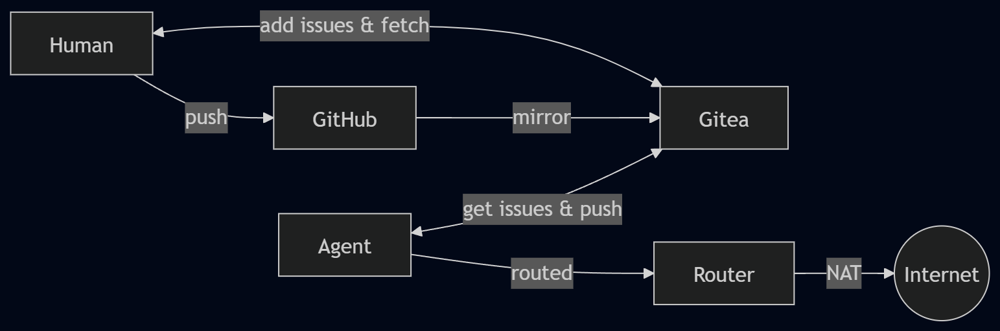
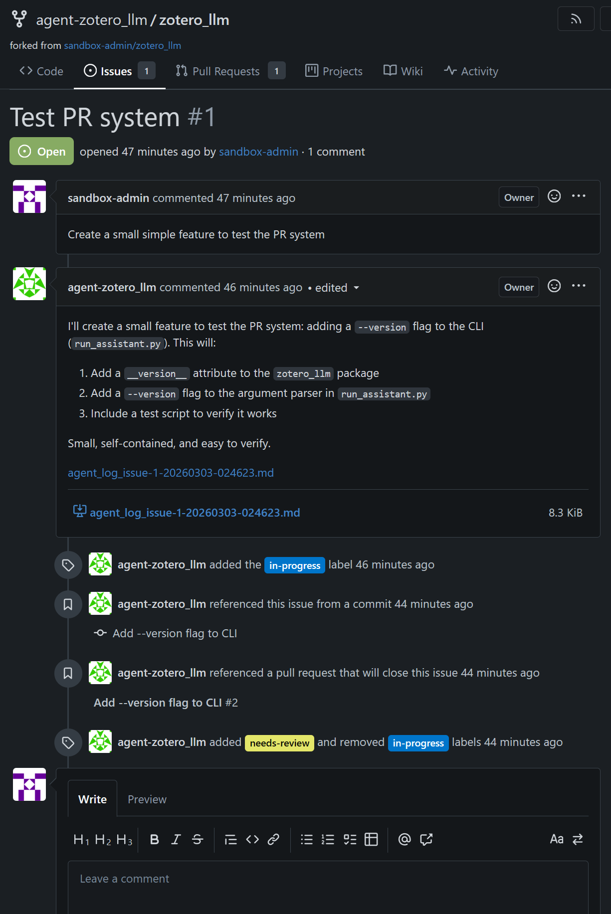
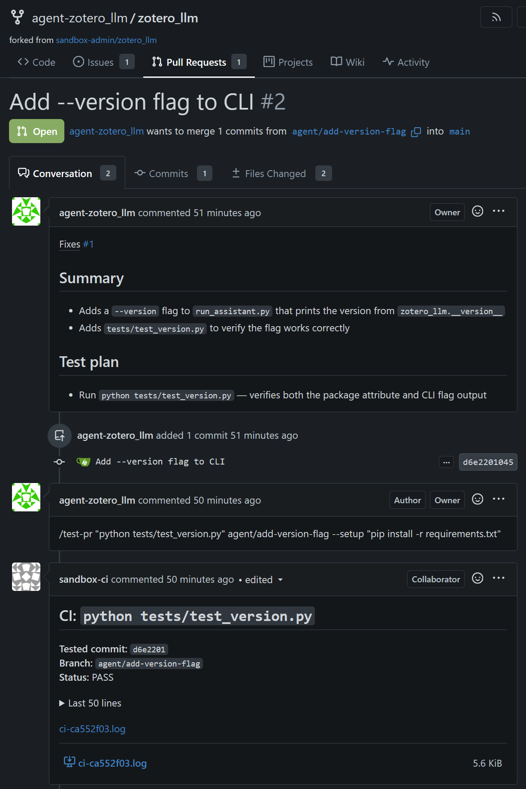

<div align="center">

# Agentic Dev Sandbox

[](https://www.python.org/)
[](https://www.docker.com/)
[](https://github.com/joaopn/agentic-dev-sandbox/actions/workflows/shellcheck.yml)
[](https://github.com/joaopn/agentic-dev-sandbox/actions/workflows/opengrep.yml)
[](https://github.com/joaopn/agentic-dev-sandbox/actions/workflows/trivy.yml)

A simple, but opinionated, per-project sandboxed development environment for agentic LLMs. The agent gets full autonomy inside of a container, but is isolated from any user data, credential or private network outside of what it is explicitly given.

*As it should be.*

</div>

### TL;DR
```bash
# 1. One-time setup (starts Gitea, router, ci-watch)
python sandbox.py setup

# 2. Create a sandboxed project with python and pre-install Claude Code
python sandbox.py create https://github.com/you/myproject --profile python --agent claude

# 3. Enter the sandbox and code away
## Use `claude` to authenticate Claude Code, F2/F3/F4 to manage windows, F6 to detach
python sandbox.py attach myproject

# 4. Fetch agent committed code (with optional security review)
python fetch-sandbox.py <myproject local repo> <agent branch name>
```

---

### Table of Contents

[◾ How it works](#-how-it-works)
[◾ Repo Watch](#-repo-watch)
[◾ Prerequisites](#-prerequisites)

[◾ Quick Start](#-quick-start)
[◾ CLI Reference](#-cli-reference)
[◾ File Structure](#-file-structure)
[◾ Alternatives](#-alternatives)
[◾ Roadmap](#-roadmap)
[◾ Further Reading](#-further-reading)

---

## ◾ How it works


- **Isolated workflow**, with a Gitea mirror of your GitHub repos. The agent pushes to Gitea, never to GitHub
- **Agent containers** are per-project, disposable, and hardened. They can't access your LAN
  - [Optional] **Repo Watch** has the agent monitoring Gitea Issues and working on them automatically
  - [Optional] **Security review** runs at fetch time — the diff is sent to an LLM for automated security analysis (backdoors, exfiltration, dependency manipulation)
- You review code e.g. in the Gitea webui and fetch it back
- You merge what you want back to GitHub (human-in-the-loop)

> [!NOTE]
> See [SECURITY.md](docs/SECURITY.md) for the full threat model, network isolation details, and static analysis design. See [BARRIER-CHECK.md](docs/BARRIER-CHECK.md) for container verification.

## ◾ Repo Watch

The agent can monitor its Gitea repo (`http://localhost:3000`) for issues and PR activity. You open an issue, the agent picks it up, discusses via comments, writes code, opens PRs, runs remote tests, and merges when you approve. You interact as a maintainer; the agent works as a junior dev.


<div style="display: flex; gap: 10px;">
  
  
</div>


Prefix an issue body or comment with a slash command (`/plan`, `/explain`, `/review`, `/test`, etc.) to add predefined prompts and restrict the agent's behavior: e.g. `/plan` to use a planning prompt and disable file writing. Commands are defined in `container/issue-commands.json` and can be customized.

To use repo-watch:
```bash
# Inside the agent container (after sandbox attach)
claude                # authenticate first
./repo-watch.sh       # agent starts monitoring repo — blocks terminal
# F2 for a new byobu window
./agent-watch.sh      # view the agent activity in real-time (optional)
```

Agent comments also attach its full internal (thinking) logs as formatted markdown. See [Repo Watch](docs/GUIDE.md#repo-watch) in the guide for details.

### CI Watch

LLM agents tend to lie and claim tests pass without running them. CI Watch remediates it by integrating passing an external CI test as a necessary PR step. The agent triggers then with a `/test-pr` or `/test-pr-bug` command and `sandbox-ci` runs the tests. The agent iterates until tests pass. Attempts to force pass with bad tests can be easily checked by the user. It can be enabled as part of `python sandbox.py setup`. See [CI Watch](docs/GUIDE.md#-ci-watch) in the guide for details.


## ◾ Prerequisites

- Docker with Compose v2 (`docker compose`)
- Python 3.10+

> [!TIP]
> Optional:
> - `GITHUB_PAT` — A read-only GitHub Personal Access Token (PAT), **only if mirroring private repos**. Only Gitea sees it.
> - `REVIEWER_API_KEY` — an LLM API key for automatic security reviews at fetch time (supports Anthropic, OpenAI, OpenRouter, or local). Never enters any container.
> - [Sysbox](https://github.com/nestybox/sysbox#installation) — only if using `--docker` for Docker-in-Docker support.

To generate the GitHub PAT:
  1. Go to https://github.com/settings/personal-access-tokens/new
  2. In Repository access, select the target repos (or all).
  3. In Permissions, click on Add Permissions and add **Contents**. Ensure it has **Access: Read-only**.

## ◾ Quick Start

```bash
# 1. One-time setup (starts Gitea, router)
python sandbox.py setup

# 2 [Optional]: configure LLM provider for security reviews at fetch time
python fetch-sandbox.py setup

# 3. Create a sandboxed project with python and Claude Code
python sandbox.py create https://github.com/you/myproject --profile python --agent claude

# 4. Interact with the agent
python sandbox.py attach myproject
## You're in a byobu terminal session inside the agent container. Code away.
## F6 to detach — the agent keeps working. F2 for another terminal, F3/F4 to switch.
## If --agent claude, `claude` will prompt authentication

# 5. Review the agent's committed work
## From the Gitea GUI: http://localhost:3000 (default port)

## From the CLI:
python fetch-sandbox.py <repo path> <branch to fetch>
## LLM security review, symlink check, auto-execute file check
## Adds the changes as unstaged changes to the current branch
```

---

<details>
<summary><h2>◾ CLI Reference</h2></summary>

```
sandbox <command> [options]

Commands:
  setup                          One-time infrastructure setup
  unsetup                        Tear down everything (containers, volumes, networks, Gitea data)
  create <github-url> [opts]     Mirror repo, spin up agent container
  attach <project>               Attach to agent's byobu session
  ssh                            Show SSH connection info (ports + passwords)
  stop <project|--all>           Stop agent container(s)
  start <project|--all>          Start stopped container(s)
  pause <project|--all>          Freeze container(s) in place (cgroup)
  unpause <project|--all>        Resume frozen container(s)
  sync <project>                 Trigger Gitea mirror sync from GitHub
  set-branch <project> <branch>  Switch agent's base branch without recreating
  recreate <project> [opts]      New container + fresh volume + fresh token
  status                         List all projects, containers, ports
  destroy <project>              Remove container, volume, Gitea user + repos
  logs <project>                 Tail container logs

Standalone script (run from your real repo):
  python fetch-sandbox.py setup                                              Configure LLM provider for security reviews
  python fetch-sandbox.py <repo_path> <branch> [--remote <name>] [--base <b>] [--skip-review]  Fetch, review, and merge agent work

Create/recreate options:
  --profile <name>               Agent image profile (required)
  --branch <name>                Base branch for agent work (default: repo default)
  --open-egress                  Allow all outbound ports (default: 80/443/DNS)
  --memory <limit>               Container memory limit (default: unlimited)
  --cpus <limit>                 Container CPU limit
  --gpus <device>                GPU passthrough (e.g., "all"); requires NVIDIA Container Toolkit
  --ssh-port <port>              Host port for SSH (default: auto-assigned)
  --agent <type>                 Agent to install and configure (e.g. claude, opencode)
  --docker                       Enable Docker-in-Docker via Sysbox runtime
```

</details>

<details>
<summary><h2>◾ File Structure</h2></summary>

```
agentic-dev-sandbox/
├── sandbox.py                    Main CLI (Python 3, stdlib only)
├── ci-config.yaml                CI watch resource limits and rate limiting
├── docker-compose.yml            Gitea + router infrastructure
├── review-config.yaml            Security review prompt and tunables
├── .env                          Config + secrets (gitignored)
├── .env.example                  Template
├── container/                    Universal + per-agent files for each workspace
│   ├── barrier-check.sh          Passive security posture checker
│   ├── repo-watch-prompt.md      Prompt template for repo-watch
│   ├── issue-commands.json       Slash command definitions for repo-watch
│   └── claude/                   Claude Code agent-specific files
│       ├── CLAUDE.md             Agent instructions
│       ├── repo-watch.sh         Agentic loop: polls issues, invokes Claude Code
│       ├── agent-watch.sh        Real-time agent activity viewer
│       └── setup.sh              Permissions bypass configuration
├── agent/
│   ├── Dockerfile.python         Agent image: conda, git, byobu, sshd
│   └── entrypoint.sh            Clone, configure git, start sshd + byobu (shared)
├── router/
│   ├── Dockerfile                NAT router image (Alpine + iptables)
│   └── scripts/
│       ├── entrypoint.sh         NAT, firewall setup
│       ├── apply-rules.sh        Per-network iptables rules (idempotent)
│       └── remove-rules.sh       Cleanup rules for a subnet
└── docs/
    ├── BARRIER-CHECK.md          Barrier check documentation and design rationale
    ├── GUIDE.md                  Profiles, reviewer, VS Code, FAQ, repo-watch details
    └── SECURITY.md               Security model, network isolation, threat table
```

</details>

---

## ◾ Alternatives
### [docker sandbox](https://docs.docker.com/ai/sandboxes/)
- Uses a microVM, more secure than runc/sysbox against CVEs
- Windows/OSX-only through Docker Desktop
- no GPU support

### [kata containers](https://github.com/kata-containers)
- Uses a microVM, full GPU passthrough
- cloud-native, high friction to configure and use on developer hardware

### [borenstein/yolo-cage](https://github.com/borenstein/yolo-cage)
- Similar idea as this
- Works directly on github

Happy to include missing alternatives, this field moves fast =)


## ◾ Roadmap
- Script support for other agentic platforms besides Claude Code (Codex, opencode)
- Podman support
- Multi-user support

## ◾ Further Reading
- **[docs/GUIDE.md](docs/GUIDE.md)** — Image profiles, reviewer setup, VS Code Remote-SSH, networking details, `container/` directory, git remotes, repo-watch internals, FAQ.
- **[docs/SECURITY.md](docs/SECURITY.md)** — Threat model, network isolation, static analysis design, what's prevented and what isn't.

<div align="center">
<sub>Licensed under <a href="LICENSE">AGPL-3.0</a></sub>
</div>
