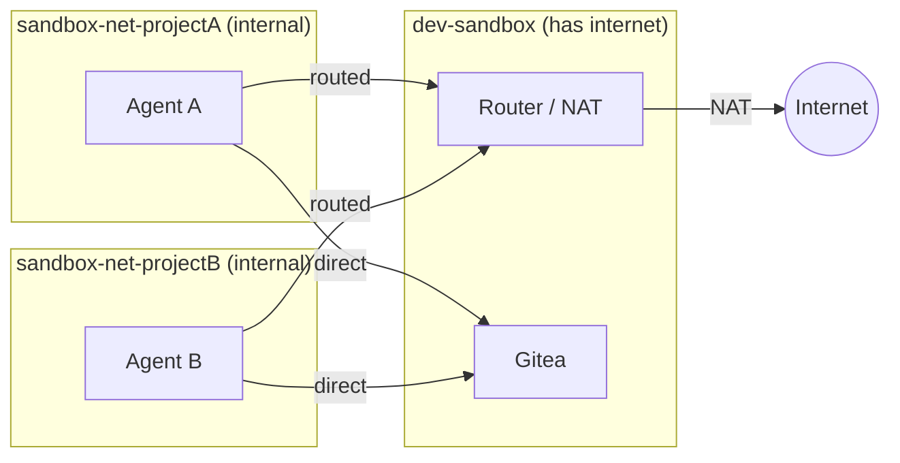

# Security

[◾ Threat Model](#-threat-model)
[◾ Network Isolation](#-network-isolation)
[◾ Static Analysis](#-static-analysis)
[◾ Barrier Testing](#-barrier-testing)
[◾ Docker-in-Docker Security](#-docker-in-docker-security)
[◾ Security FAQ](#-security-faq)

---

## ◾ Threat Model

| Threat | Defense |
|---|---|
| Agent pushes to real GitHub | No GitHub credentials in container |
| Agent reads host filesystem | Docker volume, no bind mount |
| Agent reaches LAN/host | Internal Docker network (no gateway) + router iptables drops RFC1918 |
| Agent exfiltrates via non-standard ports | Router FORWARD chain allows only 80/443/DNS/ICMP (default) |
| Agent modifies its own routing | No NET_ADMIN capability; route injected from a separate throwaway container |
| Router goes down | Fail-closed: internal network has no gateway, agent loses all external connectivity |
| Poisoned code enters real repo | Gitea air gap + LLM security review + human review |
| Symlinks/dotfiles auto-execute | Pre-merge safety checks flag them |
| Agent modifies its own review | Separate API key, runs on host only at fetch time |
| Agent accesses other projects | Per-project Gitea user + per-project network isolation |
| Compromised agent attacks others | Per-project networks prevent inter-agent communication |

### Not prevented

- Agent reading all code in its project (necessary for it to work)
- HTTPS exfiltration to public endpoints of whatever the agent has access to (inherent to internet access)
- LLM review missing a subtle backdoor (it's a filter, not a guarantee)
- Container escape via unpatched kernel/runc CVE (same risk as any container, though see [BARRIER-CHECK.md](BARRIER-CHECK.md))

## ◾ Network Isolation

Each agent gets its own **internal Docker network** (`sandbox-net-{project}`) with
no gateway — it cannot reach the internet or your LAN directly. A NAT router container
bridges the agent's internal network and the external network, providing native
DNS, ICMP, and all-protocol support without any proxy configuration.

This means:
- **Agents are isolated from each other** — each project gets its own internal
  network. Agent A cannot reach Agent B, even if both are running simultaneously.
- **All internet traffic is routed through the router** — the agent's default route
  points to the router container. If the router is down, the agent has no external
  connectivity (fail-closed).
- **LAN is unreachable** — the router's iptables FORWARD chain drops all traffic
  to RFC1918 destinations (10.0.0.0/8, 172.16.0.0/12, 192.168.0.0/16, link-local).
- **Egress port filtering** (default): Only HTTP (80), HTTPS (443), DNS (53), and
  ICMP are allowed. Use `--open-egress` to allow all destination ports for e.g. MCP servers.
- **Native networking** — `ping`, `apt`, `pip`, `curl`, and any tool that expects
  normal internet access work out of the box. No proxy configuration needed.
- **Infrastructure access** — Gitea and the router are connected to each agent's
  network on demand, so the agent can reach them directly.
- **Route injection** — the agent's default route is set via a throwaway privileged
  container (`docker run --rm --privileged --network container:<agent> alpine ip route ...`).
  The agent never receives NET_ADMIN and cannot modify its own routing.

## ◾ Static Analysis

Three CI workflows run on every push and pull request. Their purpose is to catch mistakes: no accidental shell bugs, no known Dockerfile misconfigurations, no obvious Python security anti-patterns.

| Workflow | Tool | Scope | Trigger |
|---|---|---|---|
| ShellCheck | [ShellCheck](https://www.shellcheck.net/) | All `.sh` files | `**/*.sh` |
| Opengrep | [Opengrep](https://opengrep.dev/) | All `.py` files | `**/*.py` |
| Trivy | [Trivy](https://trivy.dev/) config scan | Dockerfiles, docker-compose.yml | `**/Dockerfile*`, `docker-compose.yml` |

### Design principles

**No inline suppressions.** All three workflows enforce that commits cannot bypass checks by adding comments to source files:

- **Opengrep** runs with `--disable-nosem`, which ignores `# nosemgrep` / `# nosem` comments
- **Trivy** has no built-in flag to ignore directives, so a pre-scan step rejects any `# trivy:ignore` found in Dockerfiles and compose files. Exceptions are centralized in `.trivyignore.yaml` (passed via `TRIVY_IGNOREFILE`)
- **ShellCheck** has no built-in flag to ignore directives, so a pre-scan step rejects any `# shellcheck disable` found in `.sh` files

All exceptions are defined in the workflow files or `.trivyignore.yaml`, visible in the repo root and subject to code review.

### Exceptions

| Check | Tool | Scope | Reason |
|---|---|---|---|
| AVD-DS-0002 (missing `USER`) | Trivy | `router/Dockerfile` only | The router requires root for iptables/NET_ADMIN. Other Dockerfiles enforce non-root users. |
| `dynamic-urllib-use-detected` | Opengrep | All `.py` files | CLI tools construct URLs from user-supplied arguments (repo URLs, API endpoints). This is expected behavior, not injection. |

### Not covered

The static analysis scans Dockerfiles as text (config mode) — it does **not** pull, build, or scan container images. This means **base image vulnerabilities** (CVEs in `alpine:3.20`, `continuumio/miniconda3`, etc.) are not detected. These depend on upstream maintainers and the user's local image freshness.

## ◾ Barrier Testing

`barrier-check.sh` is a passive security posture checker that validates every barrier in the threat model above. Run it on the host (some checks fail) and in the sandbox (all pass) — the delta is the proof. See [BARRIER-CHECK.md](BARRIER-CHECK.md) for full documentation, including why active exploitation testing and agentic testing are excluded.

> [!NOTE]
> When `--docker` is enabled, several barrier-check tests will report `[FAIL]` — this is expected. Sysbox grants the container capabilities (SYS_ADMIN, NET_ADMIN, etc.) and creates Docker/containerd sockets that the standard sandbox does not have. These capabilities are scoped to a Sysbox user namespace and have no effect on the host. The Docker socket is the inner daemon, not the host's. See the comparison table below for the full list of expected differences.

## ◾ Docker-in-Docker Security

With `--docker`, the container runs under [Sysbox](https://github.com/nestybox/sysbox) instead of the default OCI runtime. Sysbox uses **user namespace isolation**: the container's root is an unprivileged user on the host, and all capabilities (SYS_ADMIN, NET_ADMIN, etc.) are real inside the namespace but have no host effect. This is what enables Docker-in-Docker without `--privileged`.

| Aspect | Standard (`--docker` off) | Docker-in-Docker (`--docker` on) |
|---|---|---|
| **OCI runtime** | Default (runc) | Sysbox (`sysbox-runc`) |
| **Capabilities** | Dropped to minimum (CHOWN, DAC_OVERRIDE, FOWNER, SETGID, SETUID, KILL, FSETID, AUDIT_WRITE, NET_RAW) | All capabilities present — scoped to Sysbox user namespace |
| **Seccomp** | Docker default profile (mode 2) | Sysbox manages isolation via user namespaces; seccomp may show disabled |
| **User namespace creation** | Blocked (`unshare --user` fails) | Allowed (Sysbox itself uses user namespaces) |
| **Docker socket** | Absent | Present (`/var/run/docker.sock` — inner daemon, not host) |
| **Containerd socket** | Absent | Present (`/run/containerd/containerd.sock` — inner daemon) |
| **Docker group** | Agent not in docker group | Agent in docker group (inner Docker access) |
| **PID limit** | 512 | 2048 (inner containers need headroom) |
| **Inner OCI runtime** | N/A | crun (avoids runc/Sysbox procfs incompatibility) |
| **Network isolation** | Internal network + NAT router | Unchanged |
| **Egress filtering** | Router iptables (80/443/DNS/ICMP) | Unchanged |
| **LAN/RFC1918 blocking** | Router drops RFC1918 | Unchanged |
| **Gitea access** | Per-project user + token | Unchanged |
| **Host filesystem** | Docker volume, no bind mount | Unchanged |
| **Security review** | Runs on host via `fetch-sandbox.py` | Unchanged |

**Why capabilities inside Sysbox are safe:** Sysbox maps the container's UID 0 to an unprivileged host UID via user namespaces. A process with SYS_ADMIN inside the container can mount filesystems *within* the namespace but cannot affect the host. Similarly, NET_ADMIN allows network configuration inside the container's network namespace but cannot modify host routing or reach other containers. This is the same isolation model used by rootless Docker and Podman.

## ◾ Security FAQ

### Why not use dev containers?

Dev containers were designed to give you a reproducible dev environment, not to isolate an untrusted agent.
By default they bind-mount your project directory (read-write), share the host network, and have no egress filtering.
The agent can read your `.git/config`, reach `localhost` services, and access anything in the mounted tree.

### Can't I just harden the dev container?

The IDE works against you.
VS Code (for instance) automatically forwards your SSH agent, git credentials, and GPG keys into the container.
Extensions run with full container permissions.
An update can re-enable unhardened defaults.

### Why not use an agent for reviews instead of a separate API key?

Two reasons: state isolation and prompt injection risk.

The review runs on the host via `fetch-sandbox.py` — a stateless one-shot LLM call with only the raw diff and a security prompt. It has no persistent context that can be corrupted.
A userland agent (Claude Code, Codex, etc.) carries mutable state: `CLAUDE.md`, `~/.claude/settings.json`, conversation history, files in the workspace. The diff being reviewed could contain prompt injection — crafted code comments, Unicode tricks, or payload filenames — that infects the agent's context permanently. Once compromised, every subsequent action by that agent is untrustworthy, including future reviews. A separate, stateless review avoids this entirely.