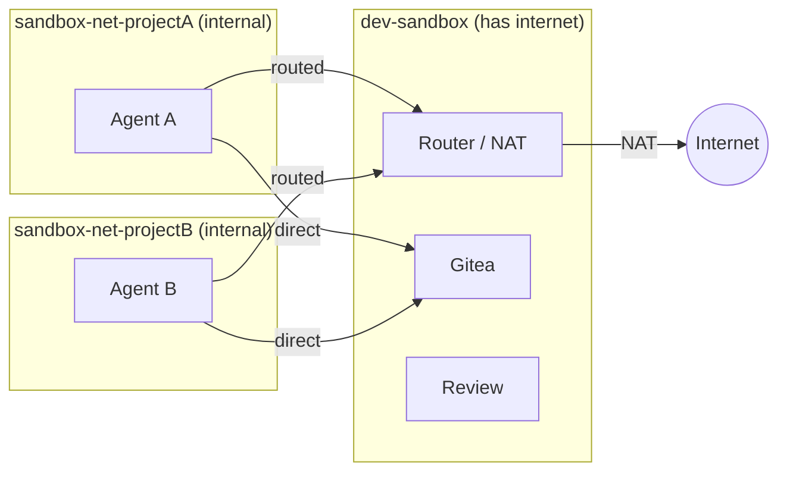

# Security

[◾ Threat Model](#-threat-model)
[◾ Network Isolation](#-network-isolation)
[◾ Static Analysis](#-static-analysis)
[◾ Barrier Testing](#-barrier-testing)
[◾ Security FAQ](#-security-faq)

---

## ◾ Threat Model

| Threat | Defense |
|---|---|
| Agent pushes to real GitHub | No GitHub credentials in container |
| Agent reads host filesystem | Docker volume, no bind mount |
| Agent reaches LAN/host | Internal Docker network (no gateway) + router iptables drops RFC1918 |
| Agent exfiltrates via non-standard ports | Router FORWARD chain allows only 80/443/DNS/ICMP (default) |
| Agent modifies its own routing | No NET_ADMIN capability; route injected from a separate throwaway container |
| Router goes down | Fail-closed: internal network has no gateway, agent loses all external connectivity |
| Poisoned code enters real repo | Gitea air gap + LLM security review + human review |
| Symlinks/dotfiles auto-execute | Pre-merge safety checks flag them |
| Agent modifies its own review | Separate API key, separate container |
| Agent accesses other projects | Per-project Gitea user + per-project network isolation |
| Compromised agent attacks others | Per-project networks prevent inter-agent communication |

### Not prevented

- Agent reading all code in its project (necessary for it to work)
- HTTPS exfiltration to public endpoints (inherent to internet access)
- LLM review missing a subtle backdoor (it's a filter, not a guarantee)
- Container escape via unpatched kernel/runc CVE (same risk as any container)

## ◾ Network Isolation

Each agent gets its own **internal Docker network** (`sandbox-net-{project}`) with
no gateway — it cannot reach the internet or your LAN directly. A NAT router container
bridges the agent's internal network and the external network, providing native
DNS, ICMP, and all-protocol support without any proxy configuration.

This means:
- **Agents are isolated from each other** — each project gets its own internal
  network. Agent A cannot reach Agent B, even if both are running simultaneously.
- **All internet traffic is routed through the router** — the agent's default route
  points to the router container. If the router is down, the agent has no external
  connectivity (fail-closed).
- **LAN is unreachable** — the router's iptables FORWARD chain drops all traffic
  to RFC1918 destinations (10.0.0.0/8, 172.16.0.0/12, 192.168.0.0/16, link-local).
- **Egress port filtering** (default): Only HTTP (80), HTTPS (443), DNS (53), and
  ICMP are allowed. Use `--open-egress` to allow all destination ports.
- **Native networking** — `ping`, `apt`, `pip`, `curl`, and any tool that expects
  normal internet access work out of the box. No proxy configuration needed.
- **Infrastructure access** — Gitea, router, and review service are connected to
  each agent's network on demand, so the agent can reach them directly.
- **Route injection** — the agent's default route is set via a throwaway privileged
  container (`docker run --rm --privileged --network container:<agent> alpine ip route ...`).
  The agent never receives NET_ADMIN and cannot modify its own routing.

## ◾ Static Analysis

Three CI workflows run on every push and pull request. Their purpose is to catch mistakes: no accidental shell bugs, no known Dockerfile misconfigurations, no obvious Python security anti-patterns.

| Workflow | Tool | Scope | Trigger |
|---|---|---|---|
| ShellCheck | [ShellCheck](https://www.shellcheck.net/) | All `.sh` files | `**/*.sh` |
| Opengrep | [Opengrep](https://opengrep.dev/) | All `.py` files | `**/*.py` |
| Trivy | [Trivy](https://trivy.dev/) config scan | Dockerfiles, docker-compose.yml | `**/Dockerfile*`, `docker-compose.yml` |

### Design principles

**No inline suppressions.** All three workflows enforce that commits cannot bypass checks by adding comments to source files:

- **Opengrep** runs with `--disable-nosem`, which ignores `# nosemgrep` / `# nosem` comments
- **Trivy** has no built-in flag to ignore directives, so a pre-scan step rejects any `# trivy:ignore` found in Dockerfiles and compose files. Exceptions are centralized in `.trivyignore.yaml` (passed via `TRIVY_IGNOREFILE`)
- **ShellCheck** has no built-in flag to ignore directives, so a pre-scan step rejects any `# shellcheck disable` found in `.sh` files

All exceptions are defined in the workflow files or `.trivyignore.yaml`, visible in the repo root and subject to code review.

### Exceptions

| Check | Tool | Scope | Reason |
|---|---|---|---|
| AVD-DS-0002 (missing `USER`) | Trivy | `router/Dockerfile` only | The router requires root for iptables/NET_ADMIN. Other Dockerfiles enforce non-root users. |
| `dynamic-urllib-use-detected` | Opengrep | All `.py` files | CLI tools construct URLs from user-supplied arguments (repo URLs, API endpoints). This is expected behavior, not injection. |

### Not covered

The static analysis scans Dockerfiles as text (config mode) — it does **not** pull, build, or scan container images. This means **base image vulnerabilities** (CVEs in `alpine:3.20`, `python:3.12-alpine`, `continuumio/miniconda3`, etc.) are not detected. These depend on upstream maintainers and the user's local image freshness.

## ◾ Barrier Testing

`pentest.sh` is a passive security posture checker that validates every barrier in the threat model above. Run it on the host (some checks fail) and in the sandbox (all pass) — the delta is the proof. See [PENTESTING.md](PENTESTING.md) for full documentation, including why active exploitation testing and agentic testing are excluded.

## ◾ Security FAQ

### Why not use dev containers?

Dev containers were designed to give you a reproducible dev environment, not to isolate an untrusted agent.
By default they bind-mount your project directory (read-write), share the host network, and have no egress filtering.
The agent can read your `.git/config`, reach `localhost` services, and access anything in the mounted tree.

### Can't I just harden the dev container?

The IDE works against you.
VS Code (for instance) automatically forwards your SSH agent, git credentials, and GPG keys into the container.
Extensions run with full container permissions.
An update can re-enable unhardened defaults.

### Why not use the agent's own Claude Code for reviews instead of a separate API key?

The review service runs in a separate container with no access to the agent's filesystem, `CLAUDE.md`, or `.claude/` directory. It receives only the raw diff and a security prompt.
This trust-domain separation matters because a compromised agent can poison its own context — writing invisible Unicode instructions into `CLAUDE.md`, planting files with prompt-injection payloads, or modifying `~/.claude/settings.json` — and any Claude Code invocation inside the same container would inherit that poisoned state. 
A self-review is not an independent review.