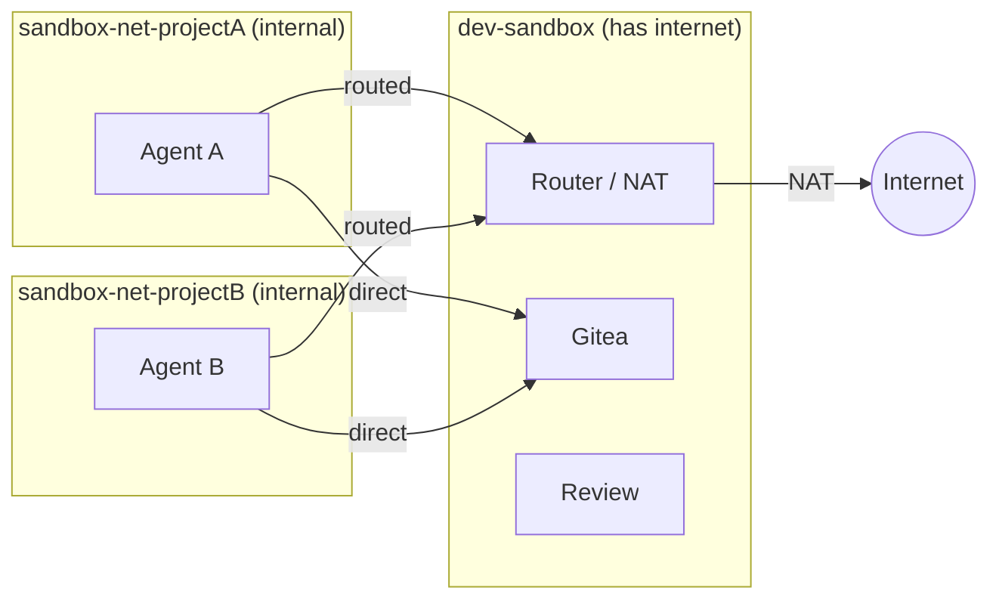

# Security

## Threat Model

| Threat | Defense |
|---|---|
| Agent pushes to real GitHub | No GitHub credentials in container |
| Agent reads host filesystem | Docker volume, no bind mount |
| Agent reaches LAN/host | Internal Docker network (no gateway) + router iptables drops RFC1918 |
| Agent exfiltrates via non-standard ports | Router FORWARD chain allows only 80/443/DNS/ICMP (default) |
| Agent modifies its own routing | No NET_ADMIN capability; route injected from a separate throwaway container |
| Router goes down | Fail-closed: internal network has no gateway, agent loses all external connectivity |
| Poisoned code enters real repo | Gitea air gap + LLM security review + human review |
| Symlinks/dotfiles auto-execute | Pre-merge safety checks flag them |
| Agent modifies its own review | Separate API key, separate container |
| Agent accesses other projects | Per-project Gitea user + per-project network isolation |
| Compromised agent attacks others | Per-project networks prevent inter-agent communication |

### Not prevented

- Agent reading all code in its project (necessary for it to work)
- HTTPS exfiltration to public endpoints (inherent to internet access)
- LLM review missing a subtle backdoor (it's a filter, not a guarantee)
- Container escape via unpatched kernel/runc CVE (same risk as any container)

## Network Isolation

Each agent gets its own **internal Docker network** (`sandbox-net-{project}`) with
no gateway — it cannot reach the internet or your LAN directly. A NAT router container
bridges the agent's internal network and the external network, providing native
DNS, ICMP, and all-protocol support without any proxy configuration.

This means:
- **Agents are isolated from each other** — each project gets its own internal
  network. Agent A cannot reach Agent B, even if both are running simultaneously.
- **All internet traffic is routed through the router** — the agent's default route
  points to the router container. If the router is down, the agent has no external
  connectivity (fail-closed).
- **LAN is unreachable** — the router's iptables FORWARD chain drops all traffic
  to RFC1918 destinations (10.0.0.0/8, 172.16.0.0/12, 192.168.0.0/16, link-local).
- **Egress port filtering** (default): Only HTTP (80), HTTPS (443), DNS (53), and
  ICMP are allowed. Use `--open-egress` to allow all destination ports.
- **Native networking** — `ping`, `apt`, `pip`, `curl`, and any tool that expects
  normal internet access work out of the box. No proxy configuration needed.
- **Infrastructure access** — Gitea, router, and review service are connected to
  each agent's network on demand, so the agent can reach them directly.
- **Route injection** — the agent's default route is set via a throwaway privileged
  container (`docker run --rm --privileged --network container:<agent> alpine ip route ...`).
  The agent never receives NET_ADMIN and cannot modify its own routing.
